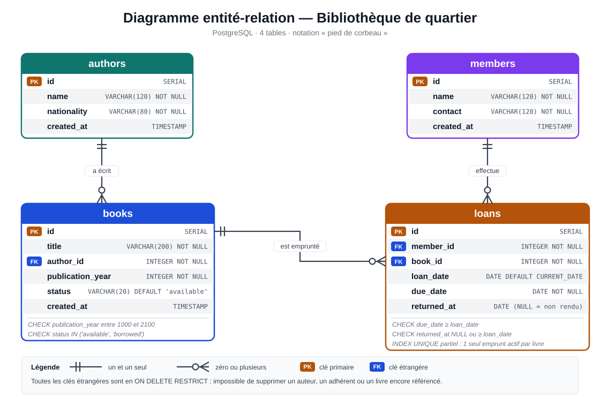
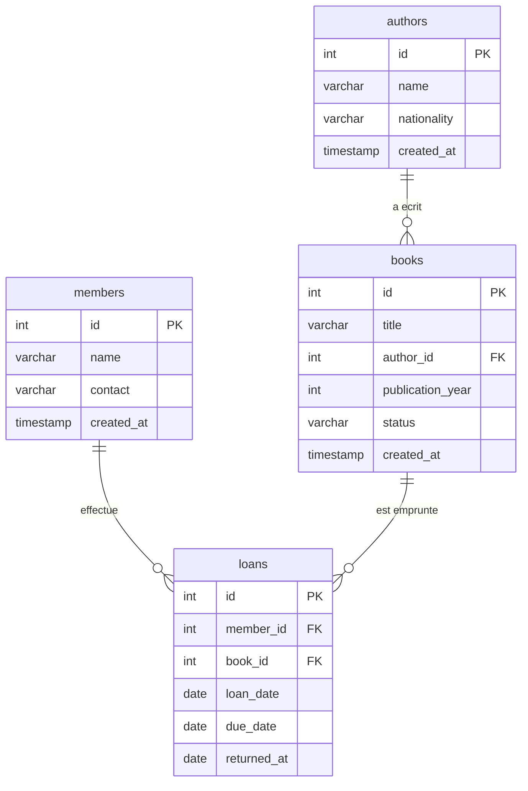

# Bibliotheque de quartier

Application simple de gestion d'une bibliotheque avec :

- Node.js
- Express
- PostgreSQL
- HTML / CSS / JavaScript natif
- API REST

Le projet couvre les besoins du cahier des charges : auteurs, adherents, livres, emprunts, retours, retards, recherche, pagination, historique et statistiques.

Application en ligne : https://lkotanga.onrender.com

## 1. Structure

```text
bibliotheque_quartier/
|-- backend/
|   |-- config/db.js
|   |-- controllers/
|   |-- middlewares/
|   |-- routes/
|   `-- server.js
|-- database/
|   |-- schema.sql
|   `-- seed.sql
|-- docs/
|   |-- demo-checklist.md
|   |-- erd.svg
|   `-- erd.png
|-- frontend/
|   |-- index.html
|   |-- authors.html
|   |-- members.html
|   |-- books.html
|   |-- loans.html
|   |-- css/style.css
|   `-- js/
|-- postman/library-api.postman_collection.json
|-- .env.example
|-- .gitignore
|-- package.json
`-- README.md
```

## 2. Logiciel a installer

Installe ces logiciels sur Windows :

1. Node.js LTS
2. PostgreSQL
3. pgAdmin 4
4. Git
5. Postman

VS Code est recommande pour modifier les fichiers.

## 3. Creer la base PostgreSQL

Ouvre pgAdmin 4.

1. Connecte-toi au serveur PostgreSQL.
2. Fais clic droit sur `Databases`.
3. Clique sur `Create` puis `Database`.
4. Donne comme nom : `bibliotheque_db`.
5. Valide.

Ensuite :

1. Clique sur `bibliotheque_db`.
2. Ouvre `Query Tool`.
3. Ouvre le fichier `database/schema.sql`.
4. Copie tout son contenu dans Query Tool.
5. Execute avec le bouton triangle.

La base contient maintenant quatre tables : `authors`, `members`, `books`, `loans`.

## 4. Donnees de test facultatives

Pour avoir quelques donnees rapidement :

1. Ouvre `database/seed.sql`.
2. Copie son contenu dans Query Tool.
3. Execute.

Ces donnees servent seulement aux essais. Tu peux ensuite les supprimer directement dans pgAdmin.

## 5. Configurer Node.js

Ouvre le dossier du projet dans VS Code.

Dans le terminal VS Code :

```bash
npm install
```

Puis copie `.env.example` et renomme la copie en `.env`.

Ouvre `.env` et adapte surtout :

```env
PORT=3000
DB_HOST=localhost
DB_PORT=5432
DB_NAME=bibliotheque_db
DB_USER=postgres
DB_PASSWORD=postgres
```

`DB_PASSWORD` doit etre le mot de passe choisi lors de l'installation de PostgreSQL.

## 6. Lancer le projet

Dans le terminal :

```bash
npm start
```

Tu dois voir :

```text
Serveur demarre sur http://localhost:3000
```

Ouvre ensuite dans le navigateur :

```text
http://localhost:3000
```

## 7. Premier test

Commence par ces pages :

1. Tableau de bord
2. Auteurs
3. Adherents
4. Livres
5. Emprunts

Ordre conseille :

- Ajouter un auteur.
- Ajouter un adherent.
- Ajouter un livre pour cet auteur.
- Creer un emprunt pour ce livre.
- Verifier que le livre passe a `borrowed`.
- Essayer de faire un deuxieme emprunt avec le meme livre : l'API doit refuser.
- Enregistrer le retour.
- Verifier que le livre repasse a `available`.
- Tester la recherche des livres.
- Tester les statistiques.

## 8. Tester avec Postman

Importe :

`postman/library-api.postman_collection.json`

Dans Postman :

1. Clique sur `Import`.
2. Choisis le fichier JSON.
3. Ouvre la collection `Bibliotheque de quartier API`.
4. Commence par `Health`.
5. Teste ensuite les routes des auteurs, adherents, livres et emprunts.

## 9. Endpoints principaux

### Auteurs

- `GET /api/authors`
- `POST /api/authors`
- `PUT /api/authors/:id`
- `DELETE /api/authors/:id`

### Adherents

- `GET /api/members`
- `POST /api/members`
- `PUT /api/members/:id`
- `DELETE /api/members/:id`
- `GET /api/members/:id/loans`

### Livres

- `GET /api/books?page=1&limit=10`
- `GET /api/books?search=orwell&page=1&limit=10`
- `POST /api/books`
- `PUT /api/books/:id`
- `DELETE /api/books/:id`

### Emprunts

- `GET /api/loans?status=all`
- `GET /api/loans?status=active`
- `GET /api/loans?status=overdue`
- `POST /api/loans`
- `PUT /api/loans/:id/return`
- `GET /api/loans/stats`

### Sante

- `GET /api/health`

## 10. Choix techniques simples

### Pourquoi quatre tables ?

- `authors` contient les auteurs.
- `members` contient les adherents.
- `books` contient les livres et leur auteur.
- `loans` contient chaque emprunt et son retour.

`loans` relie un adherent et un livre : un adherent peut emprunter plusieurs livres, et un livre peut etre emprunte plusieurs fois au fil du temps. Cette table garde aussi la date d'emprunt, la date de retour prevue et la date de retour reelle.

### Pourquoi garder `status` dans `books` ?

Le cahier des charges demande que le statut soit visible dans la liste des livres. Le statut est donc mis a jour lors de la creation et du retour d'un emprunt.

### Pourquoi une transaction pour emprunter et rendre ?

Pour eviter une situation ou l'emprunt serait cree mais que le livre ne serait pas passe en `borrowed`, ou inversement.

### Pourquoi un index unique partiel sur `loans` ?

Un livre ne peut avoir qu'un seul emprunt actif a la fois. Pour le garantir directement dans la base, `schema.sql` cree un index unique partiel :

```sql
CREATE UNIQUE INDEX one_active_loan_per_book
ON loans(book_id)
WHERE returned_at IS NULL;
```

Il ne peut exister qu'une seule ligne non rendue (`returned_at IS NULL`) par livre. Les anciens emprunts deja rendus ne comptent pas, donc l'historique d'un livre peut contenir autant d'emprunts que necessaire. Meme si deux personnes essaient d'emprunter le meme livre en meme temps, la base refuse le deuxieme emprunt.

### Pourquoi ne pas supprimer l'historique ?

Toutes les cles etrangeres (`books.author_id`, `loans.member_id`, `loans.book_id`) utilisent `ON DELETE RESTRICT` : on ne peut pas supprimer un auteur, un adherent ou un livre tant qu'il est encore reference ailleurs. Cela evite de perdre l'historique des emprunts ou de laisser un livre sans auteur. L'API renvoie alors une erreur 409 avec un message clair.

### Comment un retard est-il detecte ?

Aucun statut "en retard" n'est stocke dans la base. Un emprunt est en retard quand `returned_at` est vide et que `due_date` est avant la date du jour. Le calcul est fait par la requete SQL a chaque affichage, donc il est toujours a jour.

## 11. Diagramme

Le diagramme entite-relation est dans `docs/erd.svg` (version image : `docs/erd.png`).



Le meme schema en version texte (affiche automatiquement par GitHub) :



Lecture du diagramme :

- Un auteur ecrit 0 a N livres ; un livre a exactement un auteur.
- Un adherent effectue 0 a N emprunts ; un emprunt concerne exactement un adherent.
- Un livre est emprunte 0 a N fois au cours du temps, mais un seul emprunt peut etre actif a la fois.

## 12. GitHub

Depuis le dossier du projet :

```bash
git init
git add .
git commit -m "Premier commit - bibliotheque"
git branch -M main
git remote add origin URL_DE_TON_DEPOT
git push -u origin main
```

Remplace `URL_DE_TON_DEPOT` par l'URL du depot GitHub cree pour le projet.

## 13. Problemes frequents

### Erreur de connexion PostgreSQL

Verifie :

- PostgreSQL est demarre.
- Le nom de base est `bibliotheque_db`.
- Le nom utilisateur est correct.
- Le mot de passe dans `.env` est correct.
- Le port est normalement `5432`.

### La page ne charge pas

Verifie que `npm start` est encore actif et que tu ouvres :

`http://localhost:3000`

### Le livre ne peut pas etre emprunte

Le livre doit etre `available`. Un livre deja `borrowed` est volontairement refuse.

## 14. Ce qui est couvert par le cahier des charges

- CRUD auteurs
- CRUD adherents
- Historique des emprunts d'un adherent
- CRUD livres
- Statut disponible / emprunte
- Recherche par titre ou auteur
- Pagination des livres
- Creation d'emprunt
- Blocage d'un livre deja emprunte
- Retour d'un livre
- Liste des emprunts en cours
- Liste des emprunts en retard
- Statistiques du tableau de bord
- Recherche via `fetch()`
- Logger
- Validation
- Gestion centralisee des erreurs
- Separation routes / controllers / middlewares
- Script SQL
- Diagramme ER
- README
- Collection Postman
- Deploiement en ligne (Neon + Render)
- JavaScript separe du HTML (`frontend/js/`)

## 15. Deploiement en ligne

Le projet est deploye avec deux services gratuits :

- **Neon** : la base de donnees PostgreSQL ;
- **Render** : l'application Node.js. Le meme service Express sert le frontend (dossier `frontend/`) et l'API (`/api/...`).

Adresse du projet en ligne : `https://lkotanga.onrender.com`

```text
Navigateur  ->  Render (Express : pages HTML + API /api/...)  ->  Neon (PostgreSQL)
```

### Configuration

En local, l'application lit les variables `DB_HOST`, `DB_PORT`, `DB_NAME`, `DB_USER` et `DB_PASSWORD` du fichier `.env`.

En ligne, elle lit une seule variable, `DATABASE_URL`, qui contient l'adresse de connexion fournie par Neon. Quand `DATABASE_URL` existe, elle est utilisee a la place des variables `DB_*` (voir `backend/config/db.js`).

| Variable | Ou la definir | Role |
|---|---|---|
| `DATABASE_URL` | Render (Environment) | Adresse de connexion a la base Neon |
| `PORT` | Fournie par Render | Port d'ecoute du serveur |

`DATABASE_URL` contient un mot de passe : elle ne doit jamais etre ecrite dans un fichier du depot Git.

### Etapes de deploiement

1. **Base de donnees** : creer un projet sur Neon, copier la chaine de connexion, puis executer `database/schema.sql` et (facultatif) `database/seed.sql` dans le SQL Editor de Neon. Executer `schema.sql` une seule fois : il supprime et recree les tables.
2. **Code** : envoyer le projet sur GitHub (voir la section 12).
3. **Application** : sur Render, creer un Web Service relie au depot GitHub, avec :
   - Build Command : `npm install`
   - Start Command : `npm start`
   - Instance : Free
   - Variable d'environnement : `DATABASE_URL`
4. **Verification** : ouvrir `https://lkotanga.onrender.com/api/health` (reponse attendue : `"status":"ok"`), puis la page d'accueil.

### Mise a jour

Chaque `git push` sur la branche `main` redeploie automatiquement l'application (comportement par defaut de Render).

### Limites du plan gratuit

- Apres environ 15 minutes sans visite, le service Render se met en veille : la premiere page peut mettre 30 a 60 secondes a s'afficher.
- L'application n'a pas d'authentification : ne pas y saisir de donnees personnelles reelles.

### Tester la version en ligne

- Postman : remplacer la variable `baseUrl` de la collection par `https://lkotanga.onrender.com/api`.
- Navigateur : parcourir les pages Tableau de bord, Livres, Auteurs, Adherents et Emprunts.